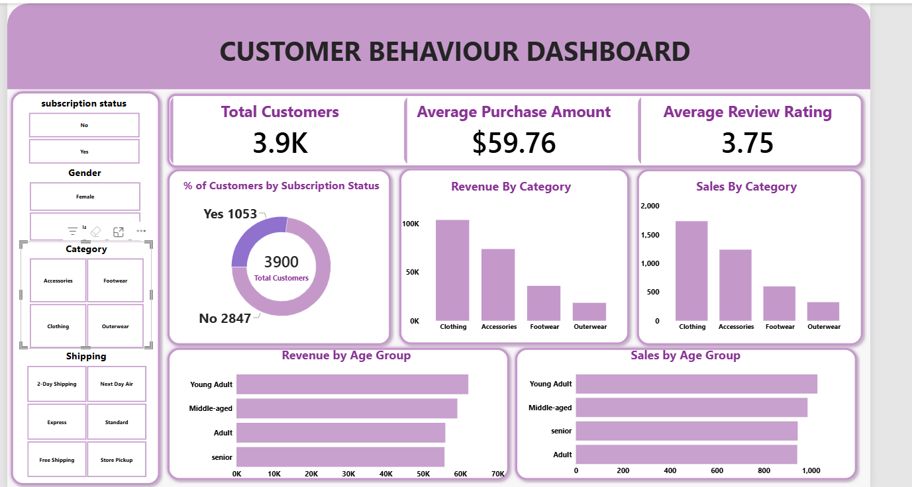

# Customer Shopping Behavior Analysis

A retail analytics portfolio project exploring customer spending, product categories, subscriptions, and shopping preferences through SQL and Power BI.

> **Project credit:** I replicated this project for learning and portfolio practice using the dataset and project materials shared by [Amlan Mohanty](https://github.com/amlanmohanty1). My customization is the Power BI dashboard theme. The original project and analytical framework are credited below.

## Business Goal

Help retail teams decide which product categories to prioritize, where to test subscription offers, and how to evaluate promotions using customer shopping data.

The analysis provides a starting point for business decisions. Recommendations are proposed tests, with no claim of implemented revenue or customer retention improvements.

## Business Questions

| Team | Question |
| --- | --- |
| Merchandising | Which categories generate the most revenue and purchases? |
| Marketing | How do spending patterns differ across customer groups? |
| Customer loyalty | How common are subscriptions among repeat buyers? |
| Pricing and promotions | Which products have the largest share of discounted purchases? |
| Operations | How does average purchase amount differ by shipping option? |

## Key Metrics

**Primary metric: average purchase amount**, supported by total purchase value, category performance, and subscription participation.

| Metric | Result |
| --- | ---: |
| Customers / purchase records | 3,900 |
| Total purchase value | $233,081 |
| Average purchase amount | $59.76 |
| Average review rating | 3.75 / 5 |
| Subscribers | 1,053 (27%) |
| Non-subscribers | 2,847 (73%) |
| Purchases with a discount | 1,677 (43%) |

Each customer appears once in the supplied CSV. Revenue refers to the sum of recorded purchase amounts; it does not include verified subscription fees or lifetime spending.

## Dashboard

The Power BI dashboard presents customer metrics, category revenue, purchase counts, subscription participation, and age-group comparisons. Filters support exploration by subscription status, gender, category, and shipping type.

[Open Power BI file](Customer_Behaviour.pbix) · [View analysis report](Customer%20Shopping%20Behavior%20Analysis.pdf) · [View presentation](Customer-behaviour.pptx)

## Key Findings

### 1. Clothing and Accessories account for most purchase value

| Category | Purchase records | Revenue |
| --- | ---: | ---: |
| Clothing | 1,737 | $104,264 |
| Accessories | 1,240 | $74,200 |
| Footwear | 599 | $36,093 |
| Outerwear | 324 | $18,524 |

Clothing and Accessories together contribute **76.6% of total revenue**. Their larger purchase counts explain much of their lead. Lower Outerwear revenue alone does not establish poor profitability or insufficient demand.

### 2. Subscriptions do not show a higher average purchase amount

Subscribers spend **$59.49** per recorded purchase, compared with **$59.87** for non-subscribers. Subscription participation is 27%, but this snapshot does not demonstrate a spending benefit from subscribing.

Among customers with more than five previous purchases, **2,518 are non-subscribers**. This is a potential audience for testing subscription benefits.

### 3. Discounts are common, but their sales impact is unproven

Discounts appear on **43% of records**. Average purchase amount is **$59.28 with a discount**, compared with **$60.13 without one**.

Hats have the highest discounted-purchase share at **50%**, followed by Sneakers at approximately **49.7%**. These figures describe promotion usage; they do not show whether discounts caused additional purchases.

### 4. Express purchases are slightly larger than Standard purchases

Average purchase amount is **$60.48 for Express** and **$58.46 for Standard** shipping. The difference is approximately **$2.01**, calculated before rounding. Shipping costs and delivery performance are needed to assess whether either option is more valuable to the business.

## Recommendations and Next Steps

| Proposed action | Evidence | How to evaluate it |
| --- | --- | --- |
| Test Clothing and Accessories cross-selling offers. | These categories contribute 76.6% of revenue. | Compare average purchase amount and profit per order against a control group. |
| Pilot subscription messaging for repeat non-subscribers. | 2,518 customers with more than five previous purchases are not subscribers. | Measure subscription conversion and subsequent repeat purchasing. |
| Test smaller or more selective discounts on frequently promoted products. | Discounts appear on 43% of records; Hats and Sneakers have the highest usage shares. | Track conversion, incremental sales, and profit after discount costs. |
| Review Outerwear demand before changing inventory or promotions. | Outerwear has the fewest purchase records. | Add stock availability, product costs, and dated sales to distinguish demand from supply constraints. |
| Evaluate shipping offers using costs as well as spending. | Express purchases average about $2 more than Standard. | Compare profit after fulfillment costs, delivery reliability, and customer feedback. |

These evaluation measures require additional data or controlled experiments and are not results already achieved by this project.

## Tools and Project Files

- **PostgreSQL:** SQL queries covering spending, subscriptions, discounts, product rankings, and customer segments.
- **Power BI:** Interactive dashboard with my customized visual theme.
- **CSV:** Source dataset containing 3,900 records and 18 columns.

| File | Purpose |
| --- | --- |
| [customer_shopping_behavior.csv](customer_shopping_behavior.csv) | Source data |
| [Customer_shopping_behaviour.sql](Customer_shopping_behaviour.sql) | Analysis queries |
| [Customer_Behaviour.pbix](Customer_Behaviour.pbix) | Power BI report |
| [Customer Shopping Behavior Analysis.pdf](Customer%20Shopping%20Behavior%20Analysis.pdf) | Supporting analysis report |
| [Customer-behaviour.pptx](Customer-behaviour.pptx) | Presentation |

The SQL script expects a prepared `customer` table with standardized column names and an `age_group` field. It is an analysis script, not a complete database setup script. The original repository includes the Python preparation notebook.

## Data Limitations

- This is a learning dataset obtained from the credited repository; it is not presented as verified operational data from a named retailer.
- No transaction dates, product costs, discount amounts, or acquisition costs are available. Time-based retention, profit, and causal promotion effects cannot be established.
- Previous purchase counts describe reported history; the underlying historical transactions are not included.
- All subscribers and all discounted purchases in this sample are male. This limits demographic comparisons and broader conclusions about subscription or promotion behavior.
- The raw CSV has 37 missing review ratings. The supplied project report describes filling them with category medians.

## Source and Acknowledgment

**Original creator:** [Amlan Mohanty](https://github.com/amlanmohanty1)

**Original project:** [Customer Trends Data Analysis — SQL, Python and Power BI](https://github.com/amlanmohanty1/customer-trends-data-analysis-SQL-Python-PowerBI)

The dataset, original business problem, analysis workflow, and reference materials were obtained from this project. I followed the project to practice the analysis and recreated the dashboard using my own theme. This README documents the replicated work, its findings, and proposed business actions.

The source repository provides an [MIT license](https://github.com/amlanmohanty1/customer-trends-data-analysis-SQL-Python-PowerBI/blob/main/LICENSE). Retain its license and copyright notice when redistributing the original materials.
